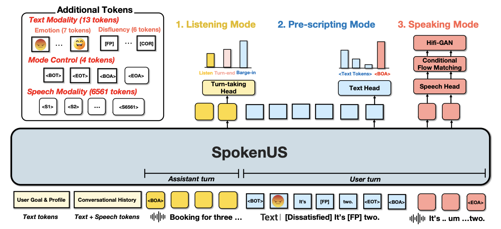

# [EMNLP 2026] SpokenUS

[](https://arxiv.org/abs/2603.16783)
[](https://holi-lab.github.io/SpokenUS/)
[](https://github.com/holi-lab/SpokenUS/tree/main/SpokenTOD)
[](https://huggingface.co/datasets/holi-lab/SpokenTOD)

We introduce **SpokenTOD**, a spoken TOD dataset comprising 52,390 dialogues and 1,034 hours of speech, augmented with four spoken user behaviors—cross-turn slots, barge-in, disfluency, and emotional prosody. Explore the augmentation and synthesis pipeline in the [`SpokenTOD/`](SpokenTOD/) directory, and download the published dataset from [Hugging Face](https://huggingface.co/datasets/holi-lab/SpokenTOD).

Building on SpokenTOD, we present **SpokenUS**, a spoken user simulator grounded in TOD with a dedicated architecture for barge-in.

## Repository Structure

- [`SpokenTOD/`](SpokenTOD/) contains the complete SpokenTOD data construction, augmentation, normalization, and speech synthesis code, together with its tests and release manifests.
- [`docs/`](docs/) contains the SpokenUS project website.

To set up the SpokenTOD pipeline from this repository:

```bash
cd SpokenTOD
uv sync --extra normalization
```

## Main Archiecture

SpokenUS takes the user’s goal and profile, the conversational history as interleaved text and speech tokens, and the current assistant speech, provided either as a complete utterance or as a streaming input. SpokenUS operates in three sequential modes: Listening Mode, which monitors incoming assistant speech to determine when to speak; Pre-scripting Mode, which generates a transcript before speech is produced; and Speaking Mode, which synthesizes the transcript into speech.




## Citation

```bibtex
@article{lee2026spokenus,
  title={{SpokenUS}: A Spoken User Simulator for Task-Oriented Dialogue},
  author={Lee, Jonggeun and Pyo, Junseong and Park, Jeongmin and Jo, Yohan},
  journal={arXiv preprint arXiv:2603.16783},
  year={2026},
  doi={10.48550/arXiv.2603.16783},
  url={https://arxiv.org/abs/2603.16783},
  eprint={2603.16783},
  archivePrefix={arXiv},
  primaryClass={cs.CL}
}
```

------

## License

SpokenTOD contains data derived from multiple source datasets, and each source-specific license governs its derived portion. The included `spokenwoz_MUL1830` example is derived from [SpokenWOZ](https://spokenwoz.github.io/) and is therefore distributed under [CC BY-NC 4.0](https://creativecommons.org/licenses/by-nc/4.0/). See the [SpokenTOD dataset card](https://huggingface.co/datasets/holi-lab/SpokenTOD) for the complete licensing and attribution requirements.
